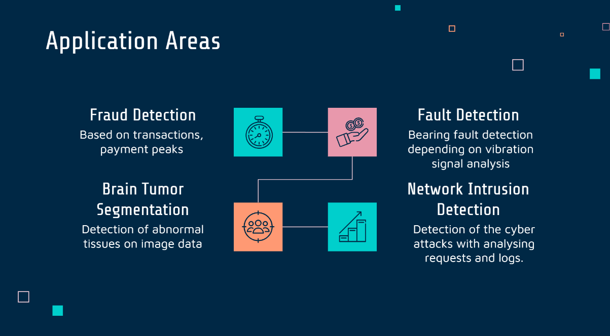
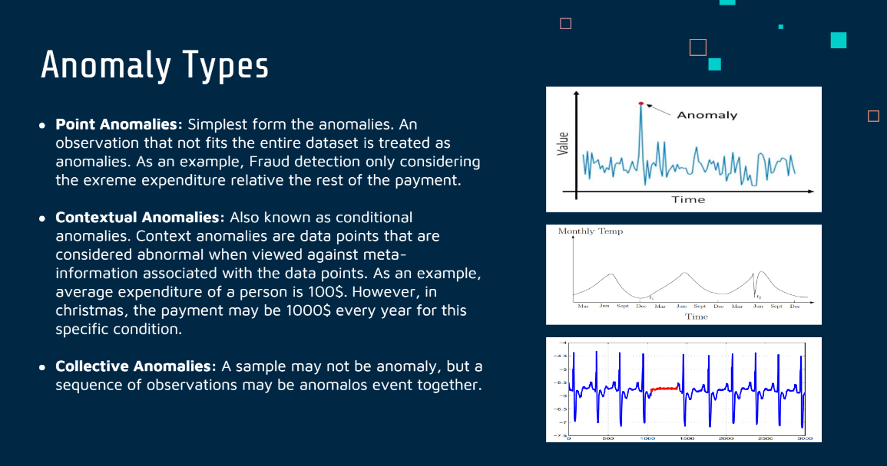
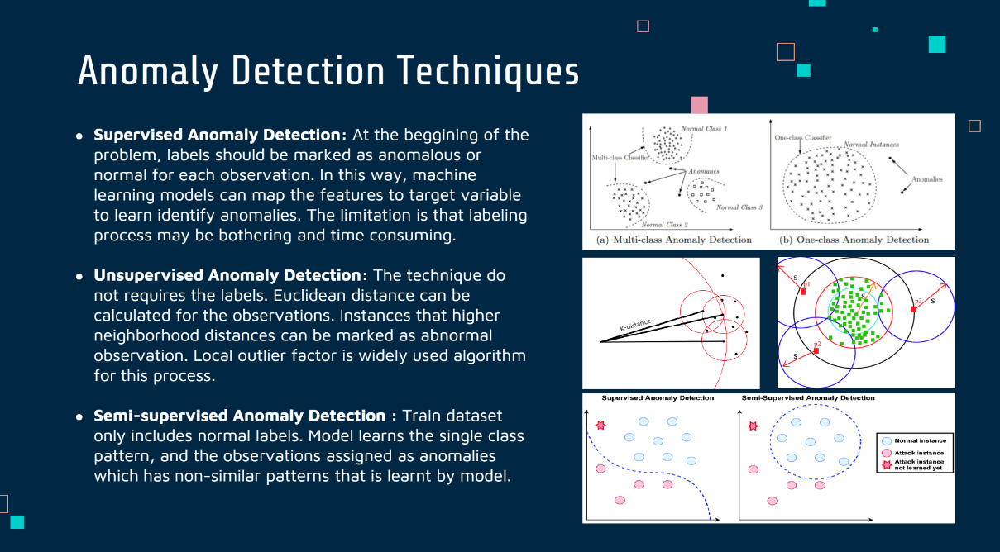
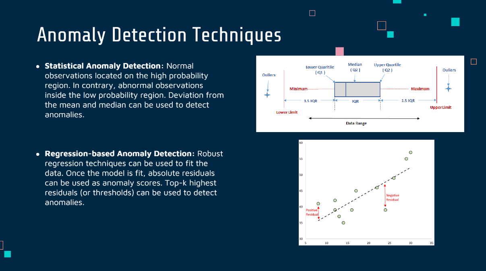

## Anomaly Detection

Anomaly detection is the process of identifying data points or observations that deviate from the expected or normal behavior. This technique involves detecting and analyzing unusual patterns or outliers using statistical methods and machine learning algorithms. Anomalies can occur in various forms, including unexpected trends, outliers, or abrupt changes in data. The significance of anomaly detection lies in its ability to identify potential problems or issues before they become severe, leading to improved operational efficiency and better product or service quality. Anomaly detection finds its application in several fields such as network intrusion detection, fraud detection, system health monitoring, and industrial quality control.

### Literature Search Notes

You can access my literature search about anomaly detection with the following link: [Anomaly Literature Review](./anomaly-literature-review.pdf)

### Application Areas:

Anomaly detection has a wide range of applications in different industries. This technique is used to identify anomalous or unexpected patterns in data, which can be applied in various domains. One of the significant areas where anomaly detection is used is fraud detection, where it can detect fraudulent transactions in sectors like insurance, healthcare, or credit card. Another application area of anomaly detection is network intrusion detection, which can detect malicious activities or cyber-attacks on computer networks. System health monitoring, predictive maintenance, industrial quality control, cybersecurity, and healthcare are other fields where anomaly detection is used to identify potential problems and prevent them before they become severe. Overall, anomaly detection is a useful tool to detect unusual behavior or patterns in data across various application areas.

- `Fraud detection`: identifying fraudulent transactions in areas such as healthcare, insurance, and credit cards

- `Predictive maintenance`:  monitoring equipment and detecting potential breakdowns or maintenance issues

- `Healthcare`: identifying unusual patterns in patient data or medical imaging that may indicate potential health issues

### Anomaly Types

There are various anomaly types but generally can be summarized as follows:

- `Point Anomalies`: It is the simplest form of anomalies. Anomalies are observations that do not conform to the rest of the dataset. For instance, in fraud detection, an observation that shows significantly higher expenditure compared to the rest of the payments may be treated as an anomaly.

- `Contextual Anomalies`: Context anomalies, also referred to as conditional anomalies, are data points that are abnormal when compared to the meta-information associated with them. For instance, if the average expenditure of a person is typically $100, but during Christmas time, it jumps to $1000 every year, then such observations may be treated as context anomalies.

- `Collective Anomalies`: A sample may not be anomaly, but a sequence of observations may be anomalos event together.

### Anomaly Detection Techniques

There are many anomaly detection techniques in literature. Most commonly used ones can be listed as follows:

- `Supervised Anomaly Detection`: At the beggining of the problem, labels should be marked as anomalous or normal for each observation. In this way, machine learning models can map the features to target variable to learn identify anomalies. The limitation is that labeling process may be bothering and time consuming.

- `Unsupervised Anomaly Detection`: The technique do not requires the labels. Euclidean distance can be calculated for the observations. Instances that higher neighborhood distances can be marked as abnormal observation. Local outlier factor is widely used algorithm for this process.

- `Semi-supervised Anomaly Detection`: Train dataset only includes normal labels. Model learns the single class pattern, and the observations assigned as anomalies which has non-similar patterns that is learnt by model. 

- `Statistical Anomaly Detection`: Unkike the abnormal observations, normal observations located on the high probability region. Therefore, deviation from the mean and median can be used to detect anomalies.

- `Regression-based Anomaly Detection`: Robust regression techniques can be used to fit the data. Once the model is fit, absolute residuals can be used as anomaly scores. Top-k highest residuals (or thresholds) can be used to detect anomalies.

### Output of the Anomaly Detection

- `Labels`: Lables of the each observation either be normal or abnormal.

- `Scores`: Instead of crisp labels, degree of anomaliness can be used to identify anomalies. The scores can be calculated in many ways. Deviation from the average value can be used as a score for each observation. In addition, in supervised anomaly detection, the probability of belonging the normal class can also be a anomaly score.

